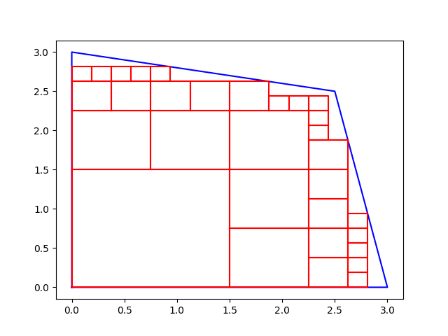
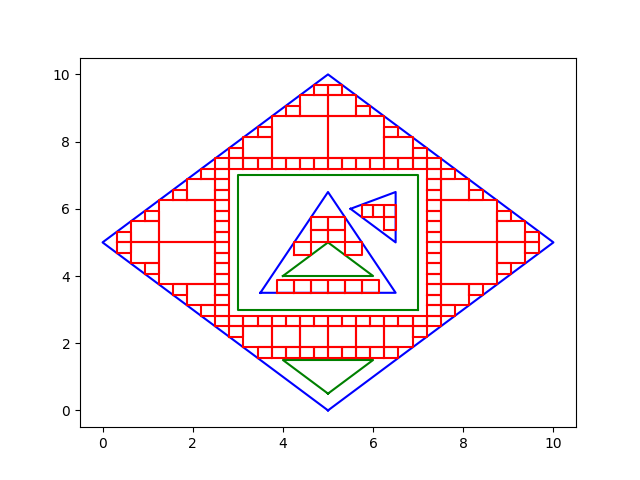

# About

`cartesianMesher2d` is a C++ implementation of a meshing algorithm, wrapped to be useable in Python. It creates a cartesian mesh (a mesh containing only rectangles) of a given polygon / polygon structure.

It is easy to use, because there is no need to convert any list to some kind of polygon object. The input parameters are just standard Python lists.

# Install from source

Clone the repository:

```bash
git clone git@github.com:Legati0/cartesianMesher2d.git
```

Build:

```bash
python setup.py build
```

Install:

```bash
python setup.py install
```

# How to use

## Return values

The return value is always a list of rectangles. A rectangle is a list of 4 points. Each point is represented by a list of size 2.

The result will look like this:

```
[
    [[x, y], [x, y], [x, y], [x, y]],
    [[x, y], [x, y], [x, y], [x, y]],
    ...
]
```

## The `mesh` function

The `mesh(polygon, minArea)` function takes a single polygon of the following shape:

```
[[x, y], [x, y], [x, y], [x, y], ...]
```

and a double value representing the smallest allowed size of any rectangle.

## The `meshMore` function

The `meshMore(polygonStructure, minArea)` function takes a complex structure of polygons. It is a list of surface-holes elements. Each of the elements consists out of a surface polygon and a list of hole polygons. A hole is just a polygon that resides inside a surface polygon. Any element has to have at least a surface polygon.

```
-----------------
|               |
|       _       |
|      /_\      |
|               |
-----------------
The rectangle is the surface polygon and the trapezoid is one of it's holes.
```

The shape of the structure is the following:

```python
[
    [   // start first element
        [[x, y], [x, y], [x, y], ...],  // surface of the element
        [   // start holes list
            [[x, y], [x, y], [x, y], ...],  // first hole
            ...
        ]   // end holes list
    ],   // end first element
    ...
]
```

The function also takes a double value representing the smallest allowed size of any rectangle.

---

### Example polygon structure:

```python
[
    # first element with 2 holes
	[
		[[5, 0], [10, 5], [5, 10], [0, 5]],
		[
			[[5, 0.5], [6, 1.5], [4, 1.5]],
			[[7, 3], [7, 7], [3, 7], [3, 3]]
		]
	],
    # second element with 1 hole
	[
		[[3.5,	3.5], [6.5, 3.5], [5, 6.5]],
		[
			[[4, 4], [6, 4], [5, 5]]
		]
	],
    # third element with no holes
	[
		[[5.5, 6], [6.5, 5], [6.5, 6.5]]
	]
]
```

# Examples
## Mesh single polygon
See `testMesh.py` 

```python
import cartesianMesher2d


poly = [[0, 0], [0, 3], [2.5, 2.5], [3, 0]]
rects = cartesianMesher2d.mesh(poly, 0.01)
print(rects)
```
This shows the following result:


The Polygon outline is in blue, the mesh in red.

## Mesh multiple polygons with holes
See `testMeshMore.py`

```python
import cartesianMesher2d


polyStructure = [
    # first element with 2 holes
	[
		[[5, 0], [10, 5], [5, 10], [0, 5]],
		[
			[[5, 0.5], [6, 1.5], [4, 1.5]],
			[[7, 3], [7, 7], [3, 7], [3, 3]]
		]
	],
    # second element with 1 hole
	[
		[[3.5,	3.5], [6.5, 3.5], [5, 6.5]],
		[
			[[4, 4], [6, 4], [5, 5]]
		]
	],
    # third element with no holes
	[
		[[5.5, 6], [6.5, 5], [6.5, 6.5]]
	]
]
rects = cartesianMesher2d.meshMore(polyStructure, 0.05)
print(rects)
```
This shows the following result:


The Faces are in blue, the Holes in green, the mesh in red.
